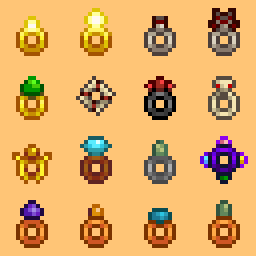
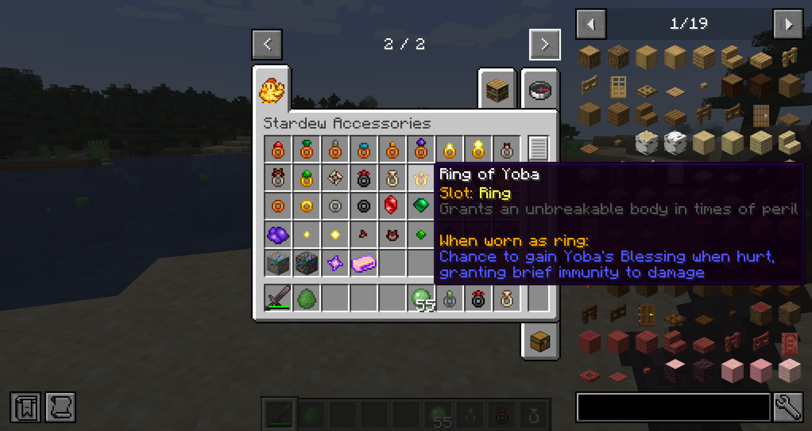
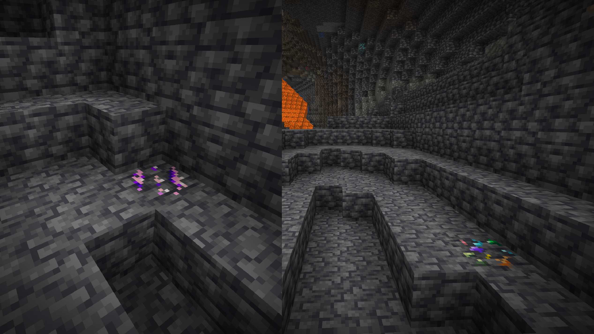
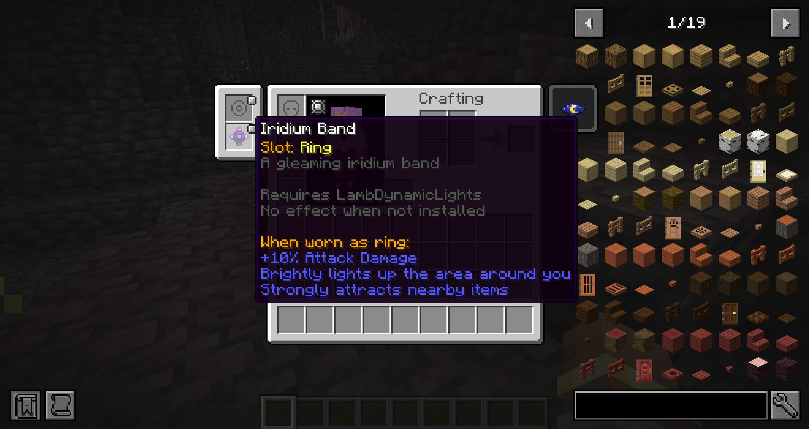

# Stardew Accessories

Bring the accessories of *Stardew Valley* to Minecraft — craft rings from gems and rare
materials, wear them in [Curios](https://modrinth.com/mod/curios) ring slots, and gain their power.

[English](#english) | [简体中文](#简体中文)

---

## English

### About

Stardew Accessories adds 17 rings inspired by the accessories of *Stardew Valley*, together with
the gems, ring blanks and ores used to craft them. Every ring is equipped through the **Curios
`ring` slot** (2 slots by default), and all of their numbers can be tuned in the config file.

### Features

#### Rings

| Ring | Effect |
|---|---|
| Ruby Ring | +10% attack damage |
| Emerald Ring | +10% attack speed |
| Jade Ring | +10% critical damage |
| Aquamarine Ring | +5% critical chance |
| Topaz Ring | +6 armor |
| Amethyst Ring | +1 attack knockback |
| Small Glow Ring | Slightly lights up the area around you |
| Glow Ring | Brightly lights up the area around you |
| Small Magnet Ring | Attracts nearby dropped items |
| Magnet Ring | Strongly attracts nearby dropped items |
| Slime Charmer Ring | Slimes and magma cubes cannot hurt you |
| Warrior Ring | Chance to gain Warrior Energy on a kill, boosting attack |
| Vampire Ring | Restores a little health whenever you slay a monster |
| Savage Ring | Short speed boost after slaying a monster |
| Ring of Yoba | Chance to gain Yoba's Blessing when hurt, granting brief immunity |
| Burglar's Ring | Monsters drop extra loot when slain |
| Iridium Band | Combines the Glow, Magnet and Ruby Rings |

#### Materials & Ores

- **Gems:** Ruby, Emerald, Jade, Aquamarine, Topaz, Amethyst
- **Ring blanks:** Ring Blank, Lumen Ring Blank, Metal Ring Blank, Dark Alloy Ring Blank
- **Crafted materials:** Lumen Dust → Lumenite, Magnet Fragments → Magnet, Starshard → Starshard Ingot
- **Special materials:** Slime Crystal, Blood Essence
- **Ores (with world generation):** Starshard Ore, Prism Ore (+ deepslate variants)
- **Where to find materials:**
  - Lumen Dust — occasionally dropped when mining glowstone
  - Magnet Fragments — occasionally found in mineshaft and dungeon chests
  - Slime Crystal — occasionally dropped by slimes and magma cubes
  - Blood Essence — occasionally dropped by bats and phantoms

### Requirements

| Requirement | Notes |
|---|---|
| Minecraft 1.21.1 | |
| NeoForge 21.1.252+ | |
| [Curios](https://modrinth.com/mod/curios) 9.x | **Required** — provides the ring slots |
| [LambDynamicLights](https://modrinth.com/mod/lambdynamiclights) 4.x | *Optional* — dynamic lighting for the glow rings. Without it the glow rings simply do not emit light. |

### Installation

1. Install NeoForge for Minecraft 1.21.1.
2. Drop the mod jar and the required **Curios** jar into your `mods` folder.
3. (Optional) Add **LambDynamicLights** to enable the glow rings' dynamic lighting.
4. Launch the game — a new creative tab holds all rings, materials and ores.

### Configuration

The config file is generated at `config/stardewaccessories-common.toml` on first launch.

All options (defaults)

| Option | Default | Description |
|---|---|---|
| `rubyRingAttackDamage` | `0.10` | Extra attack damage (0.10 = +10%) |
| `emeraldRingAttackSpeed` | `0.10` | Extra attack speed (0.10 = +10%) |
| `jadeRingCritDamage` | `0.10` | Extra critical damage |
| `aquamarineRingCritChance` | `0.05` | Extra critical chance |
| `topazRingArmor` | `6.0` | Extra armor |
| `amethystRingKnockback` | `1.0` | Extra attack knockback |
| `smallGlowRingLight` | `8` | Small Glow Ring light level (0–15) |
| `glowRingLight` | `15` | Glow Ring light level (0–15) |
| `smallMagnetRingRange` | `3.0` | Small Magnet Ring radius (blocks) |
| `smallMagnetRingPullSpeed` | `1.0` | Small Magnet Ring pull speed |
| `magnetRingRange` | `5.0` | Magnet Ring radius (blocks) |
| `warriorRingProcChance` | `0.10` | Warrior Energy chance on kill |
| `warriorEnergyAttackDamage` | `10.0` | Warrior Energy bonus attack damage |
| `warriorEnergyDuration` | `100` | Warrior Energy duration (ticks) |
| `vampireRingHealAmount` | `2.0` | Heal per kill (2.0 = 1 heart) |
| `savageRingSpeedDuration` | `40` | Savage Ring speed duration (ticks) |
| `savageRingSpeedAmplifier` | `0` | Savage Ring speed level (0 = Speed I) |
| `ringOfYobaProcChance` | `0.05` | Yoba's Blessing chance when hurt |
| `yobasBlessingDuration` | `100` | Yoba's Blessing duration (ticks) |
| `burglarsRingExtraDropChance` | `0.5` | Burglar's Ring extra-drop chance |
| `lumenDustGlowstoneChance` | `0.05` | Lumen Dust drop chance from glowstone |
| `magnetFragmentsChestChance` | `0.10` | Magnet Fragments chance in chests |
| `slimeCrystalSlimeChance` | `0.01` | Slime Crystal drop chance from slimes |
| `bloodEssenceBatChance` | `0.05` | Blood Essence drop chance from bats |
| `bloodEssencePhantomChance` | `0.10` | Blood Essence drop chance from phantoms |

### Screenshots

### Credits

- Inspired by **Stardew Valley**, created by **ConcernedApe**.
- [Curios API](https://modrinth.com/mod/curios) by **TheIllusiveC4**.
- [LambDynamicLights](https://modrinth.com/mod/lambdynamiclights) by **LambdAurora**.

### Disclaimer

This is an unofficial fan project. It is not affiliated with or endorsed by ConcernedApe or
Chucklefish. *Stardew Valley* and its assets are the property of their respective owners; no
official game assets are distributed with this mod.

### License

[MIT](LICENSE)

---

## 简体中文

### 简介

Stardew Accessories 把《星露谷物语》中的饰品带入 Minecraft：用宝石与稀有材料合成戒指，
通过 **Curios 的 `ring` 槽位**（默认 2 格）佩戴以获得效果。全部数值都可以在配置文件中调整。

### 特性

#### 戒指（17 枚）

| 戒指 | 效果 |
|---|---|
| 红宝石戒指 | +10% 攻击伤害 |
| 绿宝石戒指 | +10% 攻速 |
| 翡翠戒指 | +10% 暴击伤害 |
| 海蓝宝石戒指 | +5% 暴击率 |
| 黄水晶戒指 | +6 护甲 |
| 紫水晶戒指 | +1 攻击击退 |
| 小型光辉戒指 | 略微照亮周围 |
| 光辉戒指 | 明亮地照亮周围 |
| 小型磁铁戒指 | 吸引附近的掉落物 |
| 磁铁戒指 | 强力吸引附近的掉落物 |
| 史莱姆克星戒指 | 史莱姆和岩浆怪无法伤害你 |
| 战士戒指 | 击杀怪物时有概率获得战士能量，提高攻击力 |
| 吸血戒指 | 每击杀一个怪物恢复少量生命 |
| 野蛮人戒指 | 击杀怪物后短暂提升移动速度 |
| 由巴的戒指 | 受到伤害时有概率获得由巴的祝福，短时间免疫伤害 |
| 窃贼戒指 | 击杀怪物时更常掉落额外战利品 |
| 铱环 | 同时拥有光辉、磁铁与红宝石戒指的效果 |

#### 材料与矿石

- **宝石：** 红宝石、绿宝石、翡翠、海蓝宝石、黄水晶、紫水晶
- **戒圈：** 空白戒指、流明空白戒指、金属空白戒指、暗合金空白戒指
- **合成材料：** 流明尘 → 流明晶，磁石碎块 → 磁石，星之碎片 → 星陨锭
- **特殊材料：** 史莱姆结晶、血之精华
- **矿石（带世界生成）：** 星陨矿石、彩晶矿石（含深板岩变种）
- **材料获取途径：**
  - 流明尘 —— 挖掘萤石时小概率掉落
  - 磁石碎块 —— 探索废弃矿井/地牢时偶尔在箱子里发现
  - 史莱姆结晶 —— 击杀史莱姆/岩浆怪时小概率掉落
  - 血之精华 —— 击杀蝙蝠/幻翼时小概率掉落

### 前置依赖

| 依赖 | 说明 |
|---|---|
| Minecraft 1.21.1 | |
| NeoForge 21.1.252+ | |
| [Curios](https://modrinth.com/mod/curios) 9.x | **必需** —— 提供戒指槽位 |
| [LambDynamicLights](https://modrinth.com/mod/lambdynamiclights) 4.x | *可选* —— 光辉戒指的动态照明；未安装则不发光，不会崩溃 |

### 安装

1. 为 Minecraft 1.21.1 安装 NeoForge。
2. 将本模组 jar 与必需的 **Curios** jar 放入 `mods` 文件夹。
3. （可选）放入 **LambDynamicLights** 以启用光辉戒指的动态照明。
4. 启动游戏，创造模式中会出现包含全部戒指、材料与矿石的独立页签。

### 配置

首次启动后会在 `config/stardewaccessories-common.toml` 生成配置文件，
全部 25 项数值（戒指效果、触发概率、材料掉落率）均可在其中调整。
各项含义与默认值见上方英文表格。

### 截图

### 致谢

- 灵感来自 **ConcernedApe** 创作的 **《星露谷物语》**。
- [Curios API](https://modrinth.com/mod/curios) —— 作者 **TheIllusiveC4**。
- [LambDynamicLights](https://modrinth.com/mod/lambdynamiclights) —— 作者 **LambdAurora**。

### 免责声明

本项目为同人作品，与 ConcernedApe、Chucklefish 无任何关联。
《星露谷物语》及其素材版权归各自所有者所有，本模组不分发任何官方游戏素材。

### 许可

[MIT](LICENSE)
